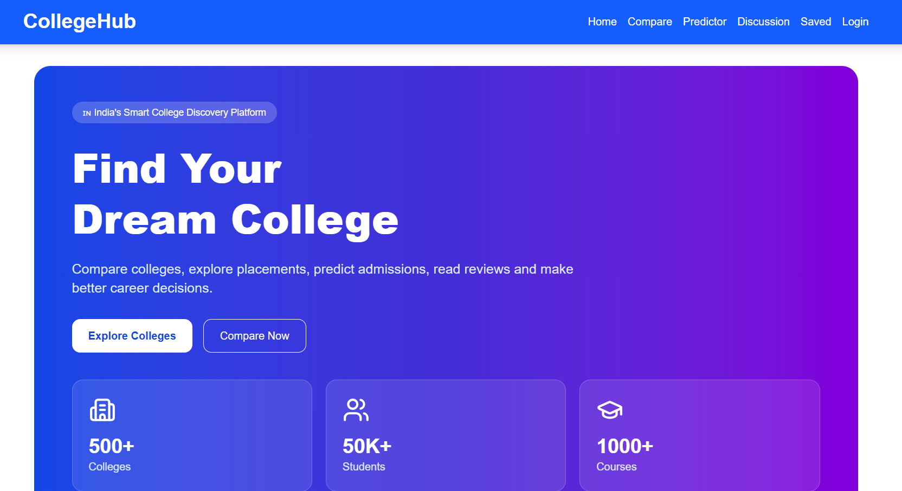
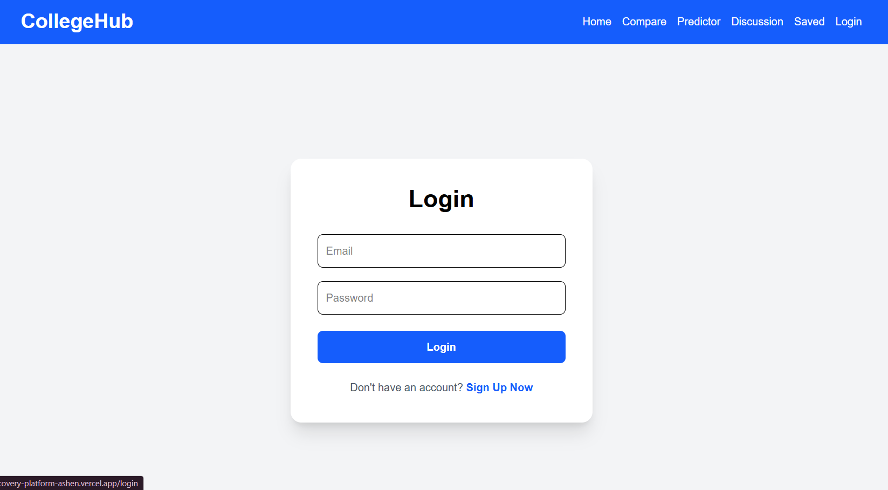
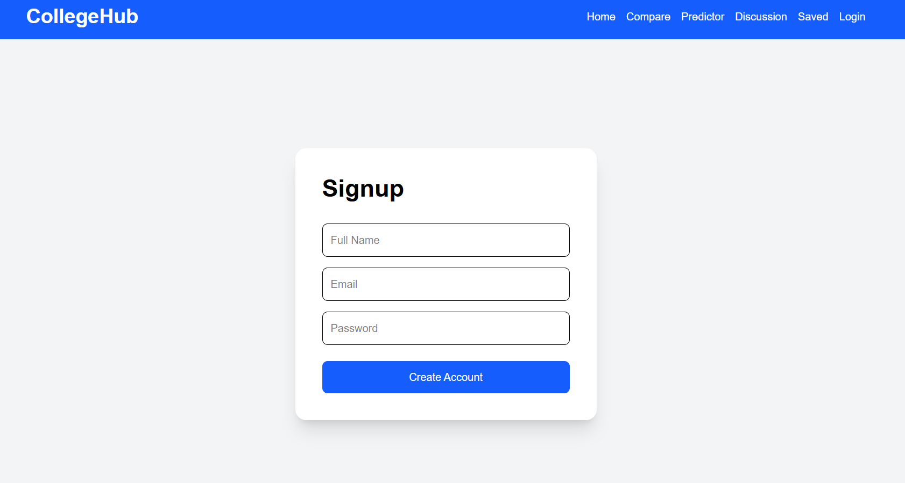
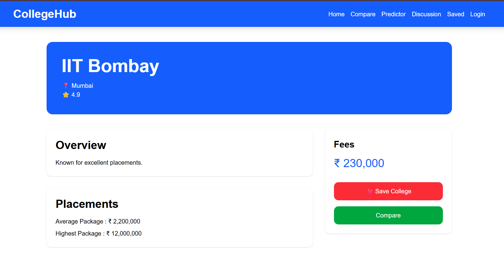
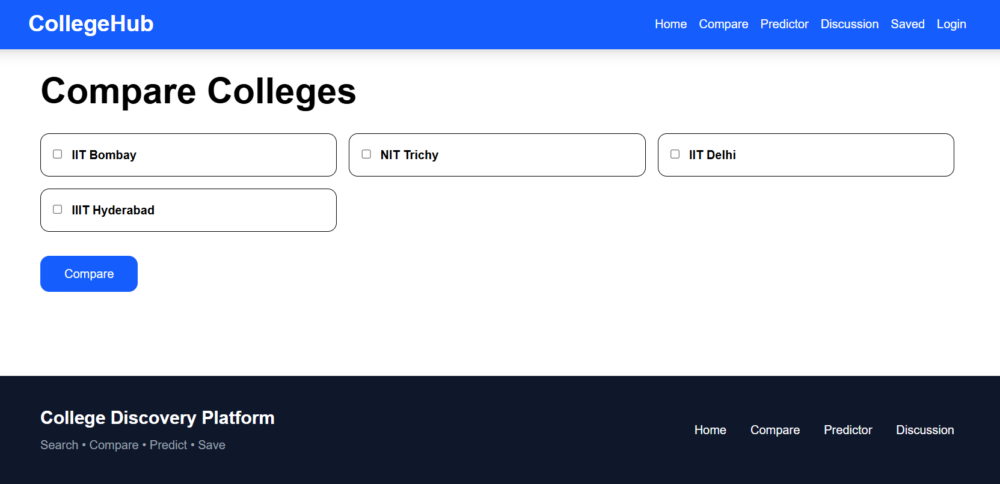
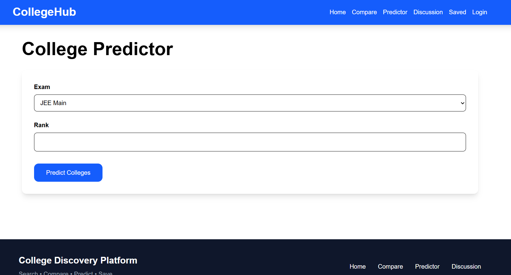
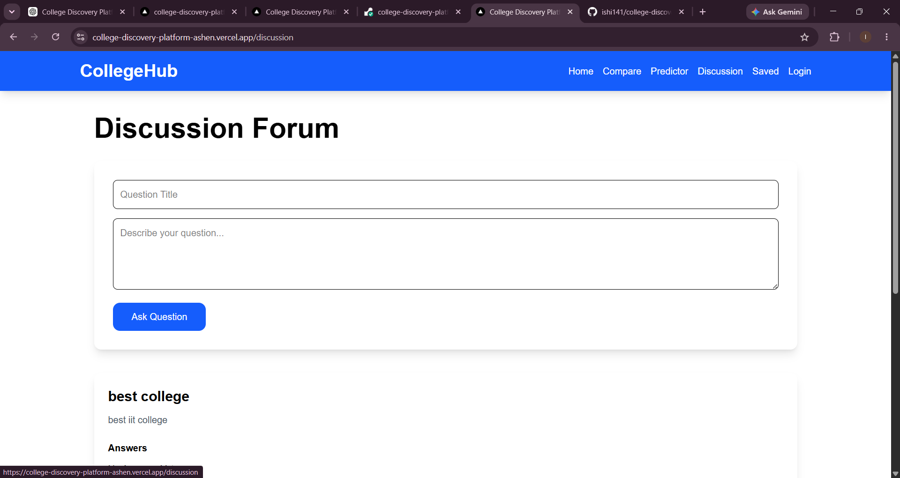

# 🎓 College Discovery Platform
A modern full-stack web application that helps students discover, compare, and evaluate colleges for higher education. The platform provides admission prediction, college comparison, discussion forums, and personalized college saving features through an intuitive and responsive interface.
---

## 🌐 Live Demo

### 🚀 Frontend
**https://college-discovery-platform-ashen.vercel.app**

### ⚙️ Backend API
**https://college-discovery-platform-dg3s.onrender.com**

---

# ✨ Features

* 🔍 Search and browse colleges
* 🏫 View detailed college information
* 📊 Compare multiple colleges
* 🎯 Admission Predictor
* ❤️ Save favourite colleges
* 🔐 Secure JWT Authentication
* 💬 Student Discussion Forum
* 📱 Fully Responsive Design
* ⚡ Fast and modern UI built with Next.js

---

# 🛠 Tech Stack

## Frontend
* Next.js
* React
* TypeScript
* Tailwind CSS
* Axios

## Backend
* Node.js
* Express.js
* TypeScript
* Prisma ORM
* JWT Authentication
* bcryptjs

## Database
* PostgreSQL (Neon)

## Deployment
* Frontend → Vercel
* Backend → Render
* Database → Neon

---

# 📂 Project Structure
```text
college-discovery-platform
│
├── backend
│   ├── prisma
│   ├── src
│   │   ├── config
│   │   ├── controllers
│   │   ├── middleware
│   │   ├── routes
│   │   ├── seed
│   │   └── server.ts
│   │
│   └── package.json
│
├── frontend
│   ├── src
│   │   ├── app
│   │   ├── components
│   │   ├── services
│   │   ├── hooks
│   │   ├── contexts
│   │   ├── utils
│   │   └── types
│   │
│   └── package.json
│
└── README.md
```

---

# ⚙️ Getting Started

## Clone the Repository
```bash
git clone https://github.com/ishi141/college-discovery-platform.git
```

```bash
cd college-discovery-platform
```
---

# Backend Setup
```bash
cd backend
```

Install dependencies
```bash
npm install
```

Create a `.env` file inside the backend folder.
```env
DATABASE_URL=your_database_url
JWT_SECRET=your_secret_key
PORT=5000
```

Run the backend
```bash
npm run dev
```
---

# Frontend Setup
Open a new terminal.
```bash
cd frontend
```

Install dependencies
```bash
npm install
```

Create a `.env.local` file.
```env
NEXT_PUBLIC_API_URL=http://localhost:5000/api
```

Run the frontend
```bash
npm run dev
```

The application will be available at
```
http://localhost:3000
```
---

# 🌍 Deployment

| Service  | Platform        |
| -------- | --------------- |
| Frontend | Vercel          |
| Backend  | Render          |
| Database | Neon PostgreSQL |

---

# 📸 Screenshots

## 🏠 Home Page

---

## 🔐 Login Page

---

## 📝 Signup Page

---

## 🏫 College Details

---

## 📊 Compare Colleges

---

## 🎯 Admission Predictor

---

## 💬 Discussion Forum

---

# 🔒 Authentication

The application uses **JWT (JSON Web Tokens)** for authentication.
Authenticated users can:
* Save colleges
* Participate in discussions
* Access personalized features

---

# 🚀 Future Improvements

* Advanced college filters
* User profile page
* AI-powered college recommendation
* College ranking visualization
* Placement analytics dashboard
* Email verification
* Password reset
* Dark mode

---

# 👨‍💻 Author

**Ishika Choubey**
GitHub: https://github.com/ishi141

---

# ⭐ Support
If you found this project helpful, consider giving it a ⭐ on GitHub.

---

# 📄 License
This project is developed for educational and learning purposes.
